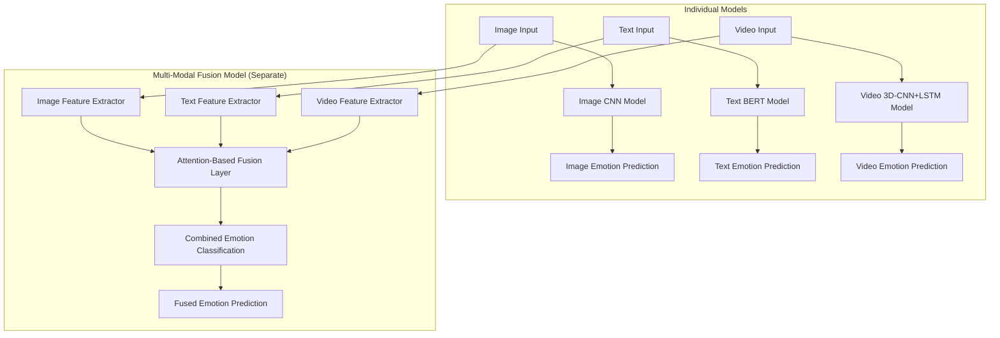

# Design Document

## Overview

The multi-modal emotion detection system consists of four main components: three specialized models for image, text, and video emotion recognition, plus a fusion model that combines all modalities. Each model uses state-of-the-art deep learning architectures optimized for their respective input types, with the final system capable of processing single or multiple modalities simultaneously.

## Architecture

### System Architecture



### Model-Specific Architectures

#### 1. Image-Based Emotion Detection

**Architecture: ResNet-50 + Custom Classification Head**

- **Base Model**: Pre-trained ResNet-50 on ImageNet for feature extraction
- **Custom Head**: 
  - Global Average Pooling
  - Dense layer (512 units) with ReLU activation
  - Dropout (0.5)
  - Dense layer (256 units) with ReLU activation
  - Output layer (6 units) with Softmax activation

**Technical Details**:
- Input size: 224x224x3 RGB images
- Face detection: MTCNN for face extraction and alignment
- Data augmentation: Random rotation (±15°), horizontal flip, brightness/contrast adjustment
- Loss function: Categorical crossentropy with class weights for imbalanced data
- Optimizer: Adam with learning rate scheduling (initial: 0.001, decay: 0.1 every 10 epochs)

#### 2. Text-Based Emotion Detection

**Architecture: DistilBERT + Classification Head**

- **Base Model**: DistilBERT-base-uncased for contextual embeddings
- **Classification Head**:
  - [CLS] token representation (768 dimensions)
  - Dense layer (256 units) with ReLU activation
  - Dropout (0.3)
  - Output layer (6 units) with Softmax activation

**Technical Details**:
- Max sequence length: 512 tokens
- Tokenization: DistilBERT tokenizer with padding and truncation
- Fine-tuning: Last 2 transformer layers + classification head
- Loss function: Categorical crossentropy with label smoothing (0.1)
- Optimizer: AdamW with warmup (10% of total steps) and linear decay

#### 3. Video-Based Emotion Detection

**Architecture: 3D CNN + LSTM Hybrid**

- **Spatial Feature Extractor**: 3D ResNet-18 for spatio-temporal features
- **Temporal Modeling**: Bidirectional LSTM (128 units)
- **Classification Head**:
  - Dense layer (256 units) with ReLU activation
  - Dropout (0.4)
  - Output layer (6 units) with Softmax activation

**Technical Details**:
- Input: 16-frame sequences at 224x224x3 resolution
- Frame sampling: Uniform sampling from video clips
- Face tracking: DeepSORT for consistent face detection across frames
- Data augmentation: Temporal jittering, spatial augmentation per frame
- Loss function: Categorical crossentropy with temporal consistency regularization

#### 4. Multi-Modal Fusion Model (Separate Combined Model)

**Architecture: Late Fusion with Attention Mechanism**

This is a completely separate model that combines features from all three modalities to create a unified emotion prediction. It serves as a fourth independent model for accuracy comparison.

- **Feature Extraction**: 
  - Uses pre-trained individual models as feature extractors (frozen weights)
  - Extracts high-level representations from each modality
- **Fusion Strategy**:
  - Attention-based weighted combination of modality features
  - Cross-modal attention to capture inter-modality relationships
  - Learns optimal weighting for each modality contribution
- **Final Classification**:
  - Concatenated attended features (image + text + video)
  - Dense layers (1536 → 512 → 256 → 6) with dropout
  - Independent emotion classification head

**Technical Details**:
- Input handling: Accepts all three modalities simultaneously
- Modality handling: Dynamic masking for missing modalities (graceful degradation)
- Attention weights: Learnable parameters for modality importance
- Training strategy: Two-stage (train individual models first, then train fusion model)
- Comparison purpose: This model's accuracy will be compared against individual models to demonstrate multi-modal benefits

## Components and Interfaces

### Data Pipeline Components

#### ImageDataLoader
```python
class ImageDataLoader:
    def __init__(self, dataset_path, batch_size=32, image_size=(224, 224))
    def load_fer2013_dataset()
    def preprocess_image(image)
    def augment_data(image, label)
    def create_data_generator()
```

#### TextDataLoader
```python
class TextDataLoader:
    def __init__(self, dataset_path, tokenizer, max_length=512)
    def load_emotion_dataset()
    def preprocess_text(text)
    def tokenize_and_encode(texts)
    def create_data_generator()
```

#### VideoDataLoader
```python
class VideoDataLoader:
    def __init__(self, dataset_path, sequence_length=16, frame_size=(224, 224))
    def load_ravdess_dataset()
    def extract_frames(video_path)
    def detect_and_align_faces(frames)
    def create_sequences(frames)
```

### Model Components

#### EmotionClassifier (Base Class)
```python
class EmotionClassifier:
    def __init__(self, num_classes=6)
    def build_model()
    def compile_model(optimizer, loss, metrics)
    def train(train_data, val_data, epochs)
    def evaluate(test_data)
    def predict(input_data)
    def save_model(path)
```

#### MultiModalFusion
```python
class MultiModalFusion:
    def __init__(self, image_model, text_model, video_model)
    def build_fusion_model()
    def attention_mechanism(features)
    def combine_modalities(image_feat, text_feat, video_feat)
    def predict_multimodal(inputs)
```

## Data Models

### Dataset Specifications

#### Image Dataset (FER-2013)
- **Source**: Facial Expression Recognition 2013 dataset
- **Size**: ~35,000 grayscale images (48x48 pixels)
- **Classes**: 7 emotions (mapped to 6 target classes)
- **Format**: CSV with pixel values and emotion labels

#### Text Dataset (Emotion Dataset for NLP)
- **Source**: Hugging Face datasets
- **Size**: ~400,000 text samples
- **Classes**: 6 emotions (anger, disgust, fear, joy, sadness, surprise → mapped to target classes)
- **Format**: JSON with text and emotion labels

#### Video Dataset (RAVDESS)
- **Source**: Ryerson Audio-Visual Database of Emotional Speech and Song
- **Size**: 7,356 video files from 24 actors
- **Classes**: 8 emotions (mapped to 6 target classes)
- **Format**: MP4 videos with standardized naming convention

### Label Mapping Strategy
```python
EMOTION_MAPPING = {
    'anger': 0,
    'disgust': 1, 
    'fear': 2,
    'happiness': 3,  # maps from 'joy', 'happy'
    'neutrality': 4,  # maps from 'neutral', 'calm'
    'sadness': 5     # maps from 'sad'
}
```

## Error Handling

### Data Loading Errors
- **Missing datasets**: Automatic download with progress tracking
- **Corrupted files**: Skip and log corrupted samples
- **Format inconsistencies**: Robust parsing with fallback strategies

### Training Errors
- **Memory issues**: Gradient accumulation and batch size adjustment
- **Convergence problems**: Learning rate scheduling and early stopping
- **Overfitting**: Regularization techniques and validation monitoring

### Inference Errors
- **Invalid inputs**: Input validation and preprocessing error handling
- **Model loading failures**: Graceful degradation to available models
- **Performance issues**: Batch processing and caching strategies

## Testing Strategy

### Unit Testing
- Individual component testing for data loaders
- Model architecture validation
- Preprocessing pipeline verification

### Integration Testing
- End-to-end pipeline testing for each modality
- Multi-modal fusion testing with various input combinations
- Performance benchmarking against baseline models

### Validation Strategy
- **Cross-validation**: 5-fold CV for robust performance estimation
- **Holdout testing**: 20% test set never seen during training
- **Ablation studies**: Component-wise contribution analysis

### Performance Metrics
- **Classification metrics**: Accuracy, Precision, Recall, F1-score per class
- **Confusion matrices**: Detailed error analysis
- **ROC curves**: Threshold analysis for each emotion class
- **Inference speed**: Latency measurements for real-time applications

### Evaluation Benchmarks
- Compare against state-of-the-art emotion recognition models
- Human baseline comparison on subset of test data
- Cross-dataset generalization testing